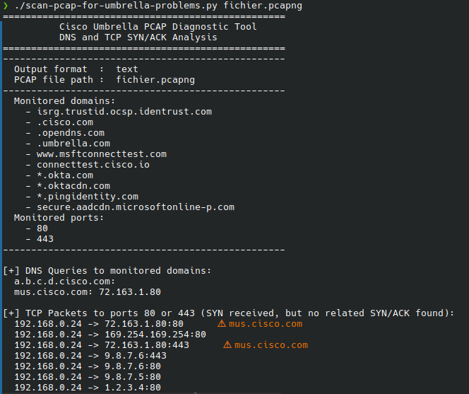

# Cisco Umbrella PCAP Diagnostic Tool



## Description

The **Cisco Umbrella PCAP Diagnostic Tool** is designed to analyze PCAP or PCAPNG files generated from a Cisco Umbrella client machine. It identifies:

- DNS queries to monitored domains and their responses.
- TCP SYN packets that did not receive a SYN/ACK response, which may indicate that these packets are being blocked by an enterprise firewall.

For each blocked packet (SYN without ACK), the tool displays the associated domain name, if resolvable.

---

## Features

- **DNS Analysis**: Extracts DNS queries to monitored domains and their associated responses.
- **TCP Analysis**: Identifies unestablished TCP sessions (SYN without ACK) to monitored ports (default: 80, 443).
- **Result Display**:
  - In text format for human readability.
  - In JSON format for easy integration with other tools.
- **Customization**:
  - Configurable list of monitored domains.
  - Configurable list of monitored ports.

---

## Prerequisites

Before using this tool, ensure that Python and the Scapy library are installed. You can install Scapy with the following command:

```bash
pip install scapy

```

---
## Usage

1. Before starting the packet capture:
   - Stop all Cisco services on the client machine.
   - Start the packet capture using a tool like Wireshark or tcpdump.
   - Run the command: `ipconfig /flushdns` to clear the DNS cache.
   - Start the Cisco AnyConnect VPN service.
2. Let the capture run for approximately 1 minute.
3. Stop the packet capture and save the file in PCAP or PCAPNG format.
4. Use this tool to analyze the generated file:
   ```
   python scan-pcap-for-umbrella-problems.py <path_to_pcap_file>
   ```

Command-line Options:
- `--domains`: Specify a custom list of monitored domains (default: predefined Cisco and Okta domains).
- `--ports`: Specify a custom list of monitored ports (default: 80, 443).
- `-o` or `--output`: Choose the output format (`text` or `json`, default: `text`).
- `-b` or `--no-banner`: Suppress the banner display.

Example:
```
python scan-pcap-for-umbrella-problems.py capture.pcap --output json
```
